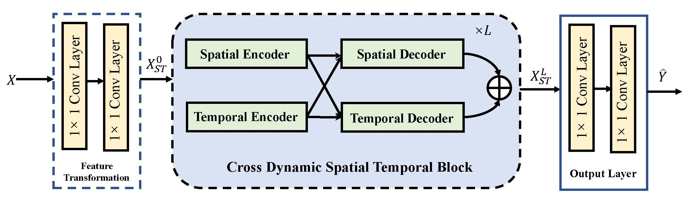

# CSTTN: Cross-dynamic Spatial Temporal Transformer Network for Traffic Prediction

The official tensorflow implementation for *Cross-dynamic Spatial Temporal Transformer Network for Traffic Prediction*.

## Introduction

In this paper, we propose an end-to-end framework termed Cross-dynamic Spatial Temporal Transformer Network(CSTTN), which models spatial-temporal correlations jointly in a cross-dynamic manner to address the aforementioned challenges.

Specifically, we utilize encoders to embed spatial and temporal correlations to obtain features, and then adopt decoders that interactively build a bridge between the embedded spatial and temporal features to capture the comprehensive representations for prediction. By stacking multiple CSTT blocks, more refined and deep spatial-temporal features can be learned.

Compared with previous works, CSTTN enables more efficient and scalable training for long-range spatial-temporal dependencies. Experimental results on two real-world public datasets, namely PeMS-BAY and PeMSD7, demonstrate that the proposed framework is competitive with the state-of-the-arts.



The implementation of CSTTN refers to the repository [STTN](https://github.com/xumingxingsjtu/STTN) [1] and [STGCN](https://github.com/VeritasYin/STGCN_IJCAI-18) [2] using tensorflow=1.15.

## requirements

Our code is based on Python3.7, a few dependencies required as follows:

1. Tensorflow>=1.14.0
2. NumPy (>= 1.15)
3. SciPy (>= 1.1.0)
4. Pandas (>= 0.24)

## Dataset

We adopted the same dataset as "Spatio-Temporal Graph Convolutional Networks:
A Deep Learning Framework for Traffic Forecasting" and "Diffusion Convolutional Recurrent Neural Network: Data-Driven Traffic Forecasting". Please refer to [STGCN](https://github.com/VeritasYin/STGCN_IJCAI-18) for
the description and preprocessing of the dataset [PeMSD7](https://pems.dot.ca.gov) and [DCRNN](https://github.com/liyaguang/DCRNN) for that of the dataset [PeMS-bay](https://github.com/liyaguang/DCRNN).

## Train

### Install

Refer to following commands to install tensorflow=1.15.

```shell
# 1. create tf1.15 env with specified python
conda create --name tf1.15 python=3.7

# 2. activate it
conda activate tf1.15

# 3.  install the correct CUDA, cuDNN with conda. Using Tsinghua mirrors could not add `-c conda-forge` option.
conda install -c conda-forge cudatoolkit=10.0 cudnn=7.4

# 4. configure the system paths in current terminal temporarily
export LD_LIBRARY_PATH=$LD_LIBRARY_PATH:$CONDA_PREFIX/lib/
# or automatically configure paths eveytime you activate this conda env by following alternative
mkdir -p $CONDA_PREFIX/etc/conda/activate.d
echo 'export LD_LIBRARY_PATH=$LD_LIBRARY_PATH:$CONDA_PREFIX/lib/' > $CONDA_PREFIX/etc/conda/activate.d/env_vars.sh

# 5. install tensorflow
pip install --upgrade pip # Be sure you're running the latest pip
pip install tensorflow-gpu==1.15 # install TensorFlow with pip

# 6. Verify the GPU setup
python3 -c "import tensorflow as tf; print(tf.test.is_gpu_available())"
# if print 'True', you've installed tensorflow-gpu suscessfully. 
```

### train PEMS-BAY

Use the command to train PEMS-BAY dataset on local as follows:

```shell
python main.py --n_route=307 --graph='data_loader/adj_mx_bay.pkl' --dataset='PEMS-BAY' --batch_size=32
```

### train PeMSD7

As default run `python main.py`, also run by parsing specified arguments:

```shell
python main.py --n_route=228 --graph='default' --dataset='PeMSD7' --batch_size=32
```

## Citation

If you find this repository, e.g., the code and the datasets, useful in your research, please cite the following paper:

```
@article{xu2020spatial,title={Spatial-temporal transformer networks for traffic flow forecasting},
author={Xu, Mingxing and Dai, Wenrui and Liu, Chunmiao and Gao, Xing and Lin, Weiyao and Qi, Guo-Jun and Xiong, Hongkai},
journal={arXiv preprint arXiv:2001.02908},
year={2020}
}
```

## Reference

+ [1] Mingxing Xu, Wenrui Dai, Chunmiao Liu, Xing Gao,Weiyao Lin, Guo-Jun Qi, and Hongkai Xiong. Spatial-temporal transformer networks for traffic flow forecasting.arXiv preprint arXiv:2001.02908, 2020
+ [2] Bing Yu, Haoteng Yin, and Zhanxing Zhu. Spatio-temporal graph convolutional networks: A deep learning framework for traffic forecasting. arXiv preprint arXiv:1709.04875,2017.
